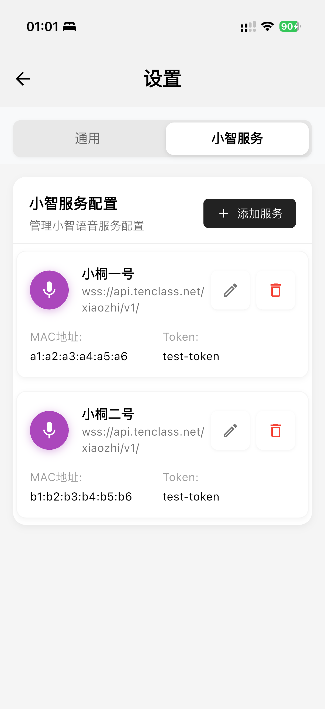
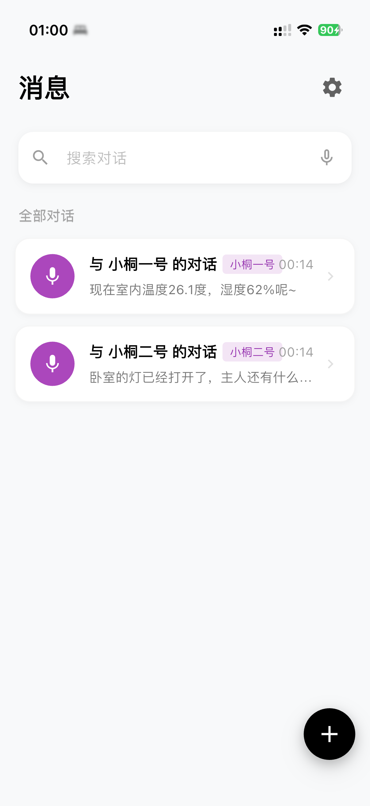

# 小智AI IOS 客户端

>一个基于WebSocket的Android语音对话应用,支持实时语音交互和文字对话。
>基于Flutter框架开发的小智AI助手，支持多平台（iOS、Android、Web、Windows、macOS、Linux）部署，提供实时语音交互和文字对话功能。

- 基本上修改自https://github.com/TOM88812/xiaozhi-android-client/;
- 只留下了小智的功能，添加了OTA;
- 效果和某宝小智机器人一样，只是换成了app版;
- 改了一下原版里面语音通话/创建小智服务端后修改不生效的问题;
- 可以连接多个;

